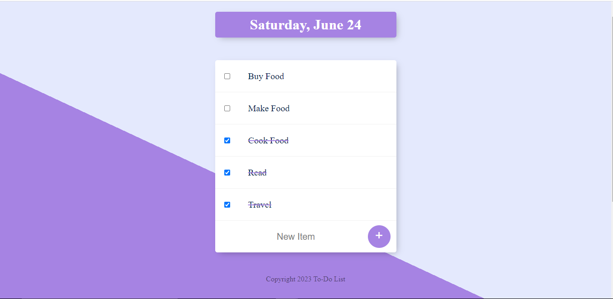
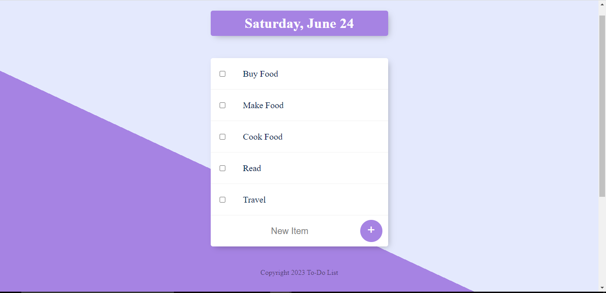

# To-Do-List - This is one of the projects for The Complete Web Development Bootcamp Course.
The Web app focusses on implementing Full Stack Web Development Using NodeJS and ExpressJS as backend along with use of requests module for working with third party apis.
This project is a template for a simple todo list app without any database. This is a v1 project. Will add database functionality later.

## Snapshots:
### 1-

### 2-

### 3-

### 3-

### Links

- Solution URL:  [Solution  URL](https://github.com/yashgjoshi20/Pen-Pals.git)
- Live Site URL: [GitHub Pages Live URL](https://yashgjoshi20.github.io/Pen-Pals/)

### Built with

- Semantic HTML5 markup
- CSS custom properties
- Flexbox
- CSS Grid
- Mobile-first workflow

For the website I've used the following resources:
* ***Icons***: [FlatIcons](https://www.flaticon.com/)
* ***Fonts***: [GoogleFonts](https://fonts.google.com/)
* ***Bootstrap***: [Bootstrap](https://getbootstrap.com/)
* ***External Packagers***: [NPM](https://www.npmjs.com/)

 ## Author

- GitHub - Yash Joshi (https://github.com/yashgjoshi20)
